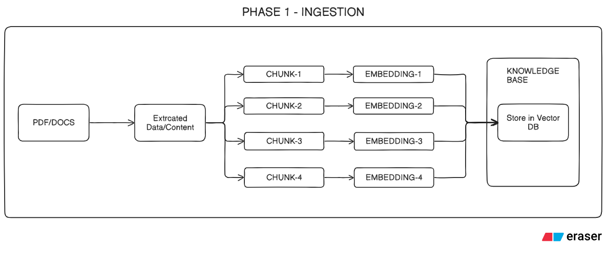
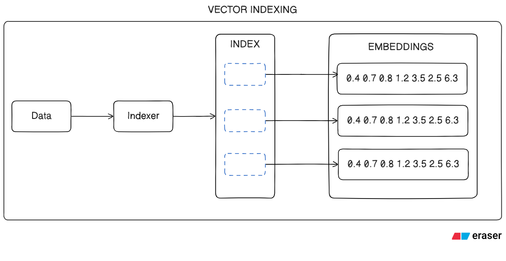
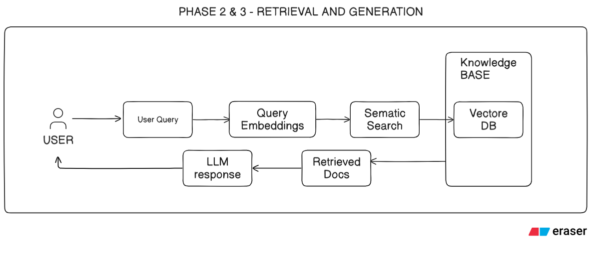
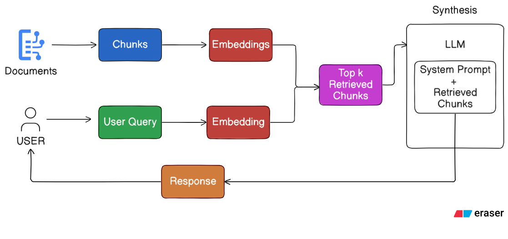
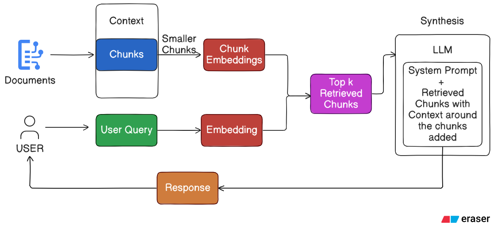
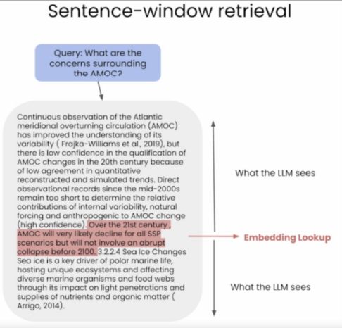
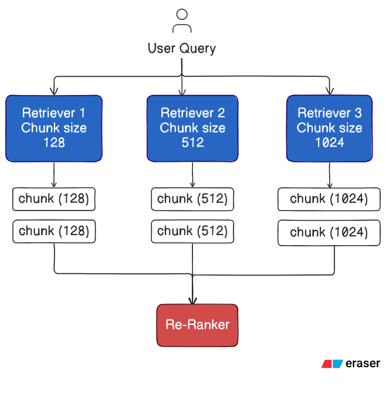

# Introduction to RAG

RAG is called Retrieval augmented generation, is an architecture used to help LLMs model like gpt- 4, Gemini, Gemma, LLAMA2,MISTRAL to provide a better response by using relevant information from additional sources and reduces the chance that llm will lead to incorrect information.

RAG is a technique that enhances language model generation by incorporating external knowledge.This is typically done by retrieving relevant information from a large corpus of documents and using that information to inform the generation process.

With RAG, the LLM is able to leverage knowledge and information that is not necessarily in its weights means it is not inside the training.

# Why we should use RAG?

1. Limited knowledge access
2. Lack of transparency: LLMs struggle to provide transparent or relevant information
3. Hallucinations in answers

# RAG Architecture.

## Phase 1 --> Ingestion

##### Lets understand the Ingestion process

#### 1. Document:

In a typical RAG pipeline, we have knowledge sources, such as Local Files, CSV, TSV, JSON, PDF, DOCs,Web pages,XML, Databases, Cloud Storage, Any Remote Location etc.

#### 2. Chunking:

We collect the data from various sources, split the data, into the chunks.

#### Why chunking is required?

We can fed the entire document also but why we are just passing the paragraph so here the reason is LLM will not be overloaded with information and Even it is having some limits in terms of tokens.

#### How to figuring out the Ideal Chunk Size?

Too small a chunk won't provide you info. It is not sufficient and These chunks can be defined either by a fixed size, such
as a specific number of characters, sentences or paragraphs. Larger chunks might include irrelevant information, introducing noise and potentially reducing the retrieval accuracy. By controlling the chunk size RAG can maintain a balance between comprehensiveness and precision.

_Based on these factors you can decide the size of chunk_

1. Data Characteristics
2. Retriever Constraints
3. Memory and Computational Resources
4. Task Requirements
5. xperimentation
6. Overlap Consideration

[For more details on Chunking Stratergies click here](https://www.pinecone.io/learn/chunking-strategies/)

#### 3. Embedding:

After chunking we convert it into vector embedding . vector embeddingare numerical representations of the data.

#### Types of embedding

1. _Frequency based embeddings_
   BOW - BAG of WORDS
   TD-IDF - Term Frequenc-Inverse Document Frequency
   N-GRAMS

2. _Neural Network based embedding_
   WORD2VEC
   FAST TEXT
   BERT
   ELMO
   OPENAI EMBEDDINGS
   GEMINI EMBEDDINGS

#### Token level embedding vs Sentence level embedding

#### How sentence transformers differ compared to token-level embedding models such as BERT?

Sentence trañsformers are specifically optimized for producing representations at the sentence level, focusing on capturing the overall semantics of sentences, which makes them particularly useful for tasks involving sentence similarit and clustering. This contrasts with token-level models like BERT, which are more focused on understanding an representing the meaning of individual tokens within their wider context.

_Checkout the links:_

https://huggingface.co/sentence-transformers
https://www.sbert.net/

[To know which embedding model you need to select click here](https://huggingface.co/spaces/mteb/leaderboard)

#### 4. Vector Embedding Indexing

A vector index is a data structure used in computer science and information retrieval to efficiently store and retrieve high dimensional vector data, enabling fast similarity searches and nearest neighbor queries.

[Click here to Learn More](https://www.datastax.com/quides/what-is-a-vector-index)

#### 5. Database or Retriever:

The retriever here could be any of the following depending on the need

_**Vector database**: A vector database indexes and stores vector embeddings for fast retrieval and similarity search, with capabilities like CRUD operations, metadata filtering, horizontal scaling, and serverless._

Vector databases are best suited for managing and querying high-dimensional data in use cases that require similarity searches.

_**Graph database**: Graph databases are designed to represent and store data as graphs. This makes it easy to represent people, products, and events along with what ties them together. Search engines, logistics businesses, and social networks typically use graph databases to understand connections in their data._

**Nodes** are the primary entities in a graph database. Each node holds all data about a person, product, business, event, or another entity.

**Edges** are the connecting parts of graph databases. They show similarities, relationships, and commonalities. You can define the properties and weights of edges to fit your purpose.

Graph databases bring you the full power of relationships in data.

_**Regular SQL Databases:**_ Offers structured data storage and retrieval but might lack the semantic flexibility of vector databases.

It can be hard to make the oice and go with either graph or vector technology for your database. With generative AI, large language models (LLM), and real-time data playing an increasing part in modern applications, we're seeing an increase in combined solutions.

With generative AI, large language models (LLM), and real-time data playing an increasing part in modern applications, we're seeing an increase in combined solutions.

This is why Neo4i recently added the ability to perform vector similarity search. They aim to make more sense of data and combat LLM hallucinations by blending similar feature vectors to input vectors found through lookups in the knowledggraph

[To know a detailed comparison of different databases click here](https://superlinked.com/vector-db-comparison/)

## Phase 2 --> Retrieval

## Phase 3 --> Generation

#### Let's Understand the retrieval process

#### Standard naive approach

The standard pipeline uses the same text chunk for indexing/embedding as well as the output synthesis.

#### Advantages:

1. Simplicity and Efficiency
2. Uniformity in Data Handling

#### Disadvantages:

1. Limited Contextual Understanding
2. Potential for Suboptimal Responses

#### Sentence-Window Retrieval / Small-to-Large Chunking

During retrieval, we retrieve the sentences that are most relevant to the query via similarity search and replace the sentence with the full surrounding context (using a static sentence-window around the context, implemented by retrieving sentences surrounding the one being originally retrieved)

#### EXAMPLE

#### Advantages:

1. Enhanced Specificity in Retrieval
2. Context-Rich Synthesis
3. Balanced Approach

Disadvantages:

1. Increased Complexity

#### Auto-merging Retriever / Hierarchical Retriever

Auto-merging retrieval aims to combine (or merge) information from multiple sources or segments of text to create a more comprehensive and contextually relevant response to a query. This approach is particularly useful when no single document or segment fully answers the query but rather the answer lies in combining information from multiple sources. It allows smaller chunks to be merged into bigger parent chunks. It does this via the following steps:

1. Define a hierarchy of smaller chunks linked to parent chunks.
2. If the set of smaller chunks linking to a parent chunk exceeds some threshold (say, cosine similarity), then “merge” smaller chunks into the bigger parent chunk.
3. The method will finally retrieve the parent chunk for better context.

#### Advantages:

1. Comprehensive Contextual Responses
2. Reduced Fragmentation
3. Dynamic Content Integration

#### Disadvantages:

1. Complexity in Hierarchy and Threshold Management
2. Risk of Overgeneralization
3. Computational Intensity

#### Ensemble Retrieval and Re-Ranking

#### Let’s Understand the augmentation and generation

_**User Input**_: A user provides a query in natural language, seeking an answer or completion.
_**Information Retrieval**_: The retrieval mechanism scans the vector database to identify segments that are semantically
similar to the user's query (which is also embedded). These segments are then given to the LLM to enrich its context for
generating responses.
_**Combining Data**_: The chosen data segments from the database are combined with the user's initial query, creating an
expanded prompt.
_**Generating Text**_: The enlarged prompt, filled with added context, is then given to the LLM, which crafts the final, contextaware response.

This process involves integrating the insights gleaned from various sources, ensuring accuracy and relevance, and crafting
a response that is not only informative but also aligns with the user's original query, maintaining a natural and
conversational tone.

# Benefits of RAG:

• With RAG, the LLM is able to leverage knowledge and information that is not necessarily in its weights, providing it access to external knowledge bases.
• Improved relevance and accuracy
• Handling open-domain queries
• Reduced generation bias
• Multi-modal capabilities
• Image captioning, content summarization
• Human-AI Collaboration
• RAG doesn't require model retraining, saving time and computational resources.

# Disadvantages of RAG:

RAG's performance depends on the comprehensiveness and correctness of the retriever’s knowledge base Information Loss

If we look at the chain of processes in the RAG system:

1. Chunking the text and generating embedding for the chunks
2. Retrieving the chunks by semantic similarity search
3. Generate response based on the text of the top_k chunks
